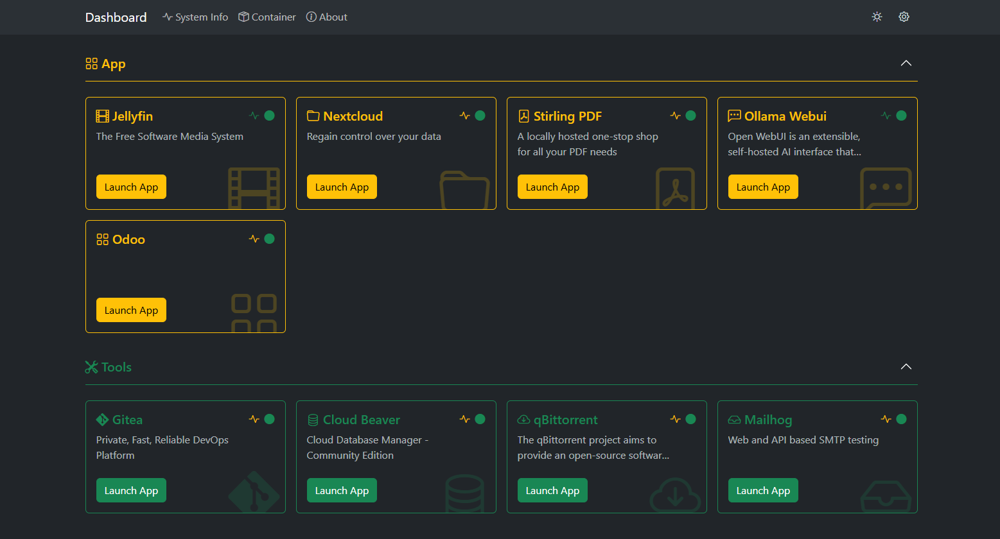

    

# Lab Visor

🚀 **Lab Visor** is a **Home Lab Landing Page & Resource Monitoring** tool designed for single Docker-based servers, making it ideal for home lab environments.

## 📌 Key Features
- 🚀 **Shortcut Management**: Easily access applications with shortcut management.
- 🖥️ **Container Integration**: Seamlessly integrate shortcuts with running containers.
- 📊 **Real-time System Monitoring**: Monitor system resources in real time.
- ⚡ **Resource Usage Tracker**: Keep track of CPU, memory, and other system metrics.

## 📜 License
This project is licensed under the **MIT License**.

---
🔥 Created with ❤️ by [fathulkirom22](https://github.com/fathulkirom22).

