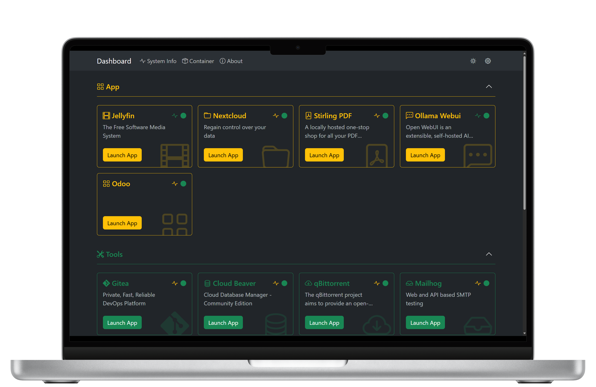

    

## Home Lab Landingpage & Resource Monitoring
Home Lab Landingpage & Resource Monitoring is a web application. designed to monitor system resources such as CPU usage, memory usage, disk usage, and more. It provides a dashboard to visualize these metrics in real-time, making it ideal for home lab environments.

## Features
- Real-time CPU and memory usage monitoring
- Disk usage visualization
- System information display
- Shortcut management for quick access to applications
- Category management for organizing shortcuts